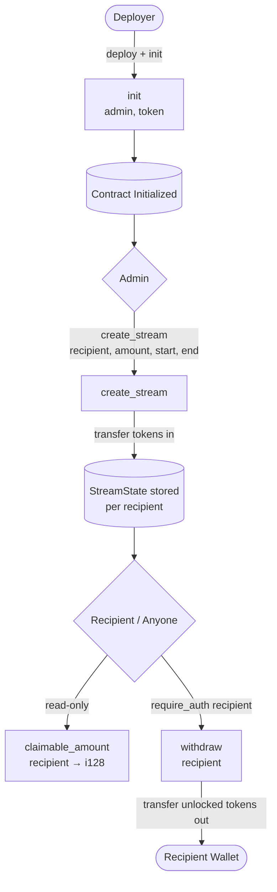
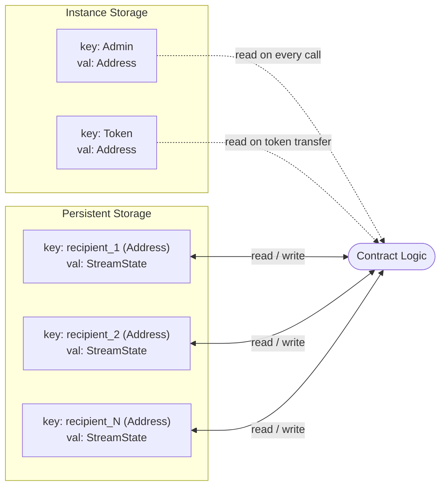

# Architecture Overview

## Contract Call Flow

### Call Flow Description

| Step | Function | Caller | Effect |
|------|----------|--------|--------|
| 1 | `init` | Deployer (once) | Stores admin + token address in instance storage |
| 2 | `create_stream` | Admin only | Transfers tokens into contract; writes `StreamState` to persistent storage |
| 3 | `claimable_amount` | Anyone | Computes `total * elapsed / duration - claimed`; read-only |
| 4 | `withdraw` | Recipient (auth required) | Transfers unlocked tokens out; updates `claimed_amount` |

---

## Storage Layout

### Storage Description

**Instance Storage** — shared contract-level data, lives as long as the contract instance:

- `Admin` — the `Address` permitted to call `create_stream`.
- `Token` — the SAC token `Address` used for all transfers in/out.

**Persistent Storage** — per-recipient data, keyed by `Address`:

- `StreamState.recipient` — beneficiary address.
- `StreamState.total_amount` — total tokens allocated to this stream.
- `StreamState.claimed_amount` — cumulative tokens already withdrawn.
- `StreamState.start_time` — Unix timestamp (seconds) when vesting begins.
- `StreamState.end_time` — Unix timestamp (seconds) when fully vested.

Each recipient has exactly one independent stream entry. A second `create_stream` call for the same recipient will panic to prevent ambiguity.
